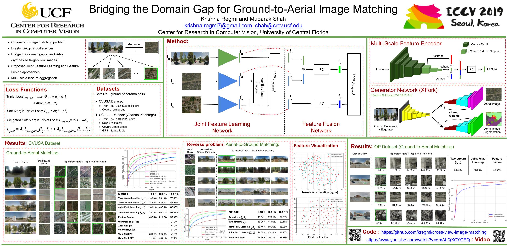

# cross-view-image-matching

[[Paper, ICCV 2019](https://www.crcv.ucf.edu/wp-content/uploads/2019/08/Publications_Bridging-the-Domain-Gap-for-Ground-to-Aerial-Image-Matching.pdf)]
[[Presentation Video](https://www.youtube.com/watch?v=gmAhQXCYCEQ)]

## Poster

## Abstract
The visual entities in cross-view (e.g. ground and aerial)images exhibit drastic domain changes due to the differences in viewpoints each set of images is captured from. Existing state-of-the-art methods address the problem by learning view-invariant image descriptors. We propose a novel method for solving this task by exploiting the generative powers of conditional GANs to synthesize an aerial representation of a ground-level panorama query and use it to minimize the domain gap between the two views. The synthesized image being from the same view as the reference (target) image, helps the network to preserve important cues in aerial images following our Joint Feature Learning approach. We fuse the complementary features from a synthesized aerial image with the original ground-level panorama features to obtain a robust query representation. In addition, we employ multi-scale feature aggregation in order to preserve image representations at different scales useful for solving this complex task. Experimental results show that our proposed approach performs significantly better than the state-of-the-art methods on the challenging CVUSA dataset in terms of top-1 and top-1% retrieval accuracies. Furthermore, we evaluate the generalization of the proposed method for urban landscapes on our newly collected cross-view localization dataset with geo-reference information.

## Code

### xview-synthesis: 
Code to synthesize cross-view images, i.e generate an aerial image for a given ground panorama and vice versa.
The code is borrowed from [cross-view image synthesis](https://github.com/kregmi/cross-view-image-synthesis).
This is implemented in Torch LUA. Refer the repo for basic instructions regarding how to get started with the code.

### two_stream: 
Code to train the two-stream baseline network.

### joint_feature_learning: 
Code to jointly learn the features for ground panorama (query) and synthesized aerial from the query and also for aerial images. (Need to generate the aerial images first).

### feature_fusion: 
Code to learn fused representations for ground panorama and synthesized aerial from ground to obtain robust query descriptor and the aerial image descriptor to use them for image matching.

The code on image matching is partly borrowed from [cvmnet](https://github.com/david-husx/crossview_localisation).
This is implemented in Tensorflow.

## Training and Test data
### Datasets
The original datasets are available here:
1. [CVUSA](http://cs.uky.edu/~jacobs/datasets/cvusa/)
2. [UCF-OP](https://knightsucfedu39751-my.sharepoint.com/:f:/g/personal/kregmi_knights_ucf_edu/EticvKYa0zFEq4HDMy7MwcgBkXWiaM6hp2i_BGswWvBY4Q?e=eTmV72) Please feel free to contact me via email if the link doesn't work.

## Models
### CVUSA Dataset

Pretrained models  can be downloaded individually here: [[xview-synthesis](https://drive.google.com/open?id=1V5qIsOqiGnBKbjG3S9bI39_Yt-tBZgRI)]  [[two-stream](https://drive.google.com/open?id=1bsTbNINVlzc2u_IM9sSkRjKevqBnPWnY)]   [[joint_feature_learning](https://drive.google.com/open?id=1u7gD7CI-yZVEZIDIqziyuIIIFEuP2RKl)]   [[feature_fusion](https://drive.google.com/open?id=13PL-sEevFsmvFC-luAevhRWsrTTqFy0G)]

All these models can be downloaded at once using this link (~ 4.2 GB). [[CVUSA Pretrained Models](https://drive.google.com/open?id=1rl4lRHR65Z0QNMKJn81X5O__Ea_DeNoS)]

## Evaluation

For ease of comparison of our method by future researchers on CVUSA and CVACT datasets, we provide the following:

Feature files for test set of CVUSA:[[CVUSA Test Features]](https://drive.google.com/open?id=1Omu4D0wBGuo0ie0T3QXbiByEy6q-AG9p)

We also conducted experiments on [[CVACT Dataset]](https://github.com/Liumouliu/OriCNN) and provide the feature files here: [[CVACT Test Features]](https://drive.google.com/open?id=1_z8BLdnTdEror-aqGDpG6gMhTt5x1XcS)

## Citation
If you find our works useful for your research, please cite the following papers: 

- Bridging the Domain Gap for Ground-to-Aerial Image Matching, ICCV 2019 [pdf](https://arxiv.org/pdf/1904.11045.pdf), [bibtex](https://github.com/kregmi/cross-view-image-matching/tree/master/resources/bibtex_iccv2019.txt)

- Cross-View Image Synthesis Using Conditional GANs, CVPR 2018 [pdf](http://openaccess.thecvf.com/content_cvpr_2018/papers/Regmi_Cross-View_Image_Synthesis_CVPR_2018_paper.pdf), [bibtex](https://github.com/kregmi/cross-view-image-synthesis/tree/master/resources/bibtex_cvpr.txt)

- Cross-view image synthesis using geometry-guided conditional GANs, CVIU 2019 [pdf](https://arxiv.org/pdf/1808.05469.pdf), [bibtex](https://github.com/kregmi/cross-view-image-synthesis/tree/master/resources/bibtex_cviu.txt)

## Questions

Please contact: 'krishna.regmi7@gmail.com'
